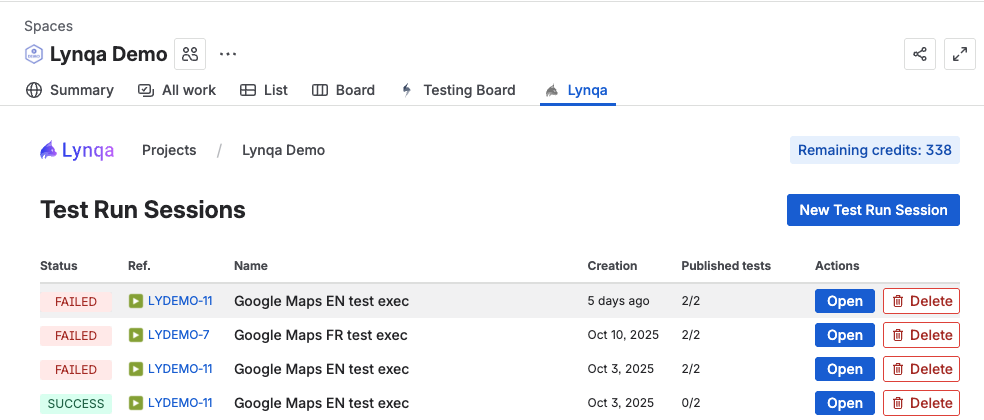
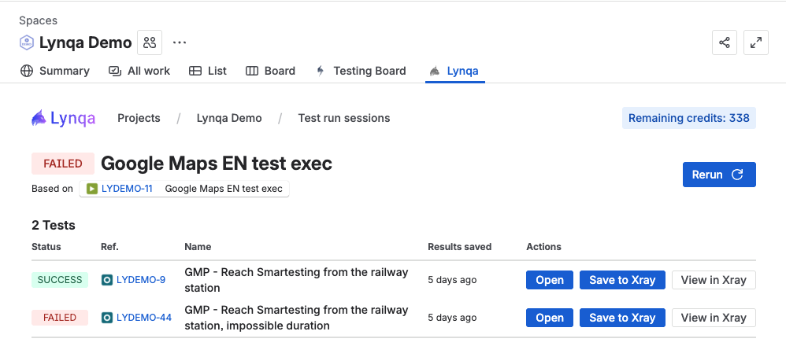
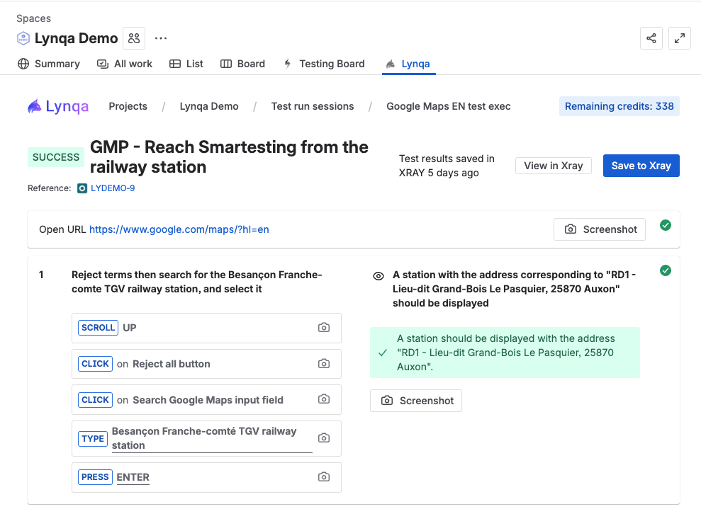
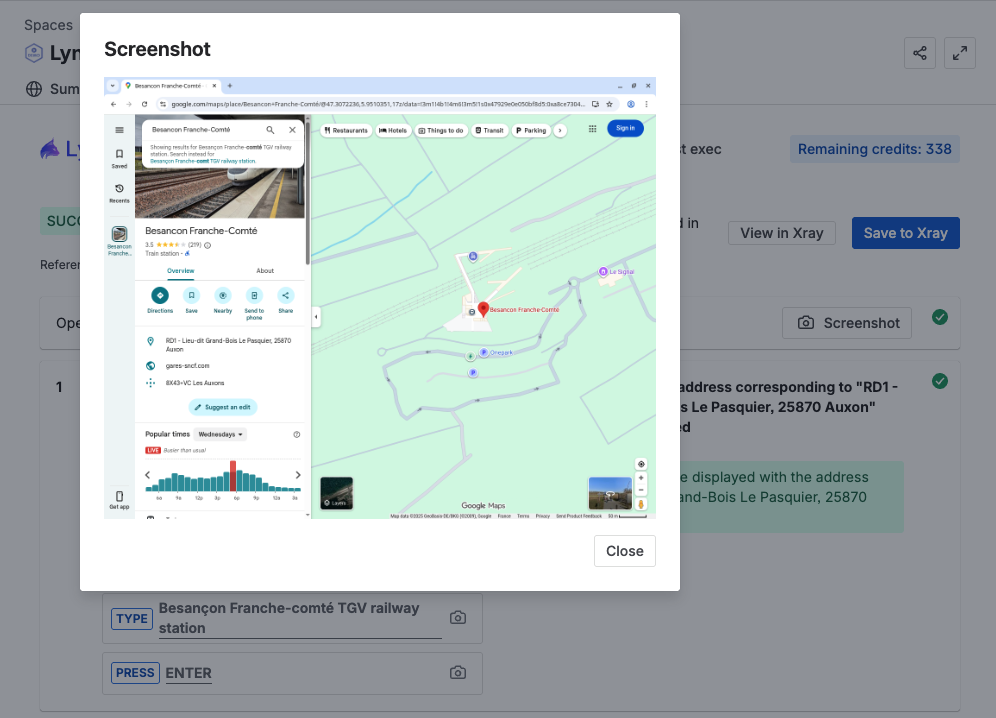

# Control Execution

This section explains how to control and manage running test executions in Lynqa.

## Overview

Lynqa allows you to monitor and manage test executions in real-time. You can drill down through different levels to see detailed execution information, from test run sessions to individual test runs and their screenshots.

## Navigating Test Executions

Lynqa provides a hierarchical view of test executions that allows you to drill down through multiple levels:

1. **Test Run Sessions** - View all your test execution sessions
2. **Test Run Session** - See all individual tests within a specific session
3. **Test Run** - Examine the detailed steps and screenshots for a particular test

At each level, you can see the current execution state for quick status overview.

## Test Run Sessions

The **Test Run Sessions** view provides an overview of all your test execution sessions. Here you can see:

- **Status** - Current execution state of each session (SUCCESS, FAILED, etc.) (see [Execution States](#execution-states) for details)
- **Reference** - Unique identifier for the test execution card
- **Name** - Descriptive name of the test execution
- **Creation** - When the session was created
- **Published tests** - Number of tests completed out of the total
- **Actions** - Open button to drill down into the session details, or Delete button to remove the session

Click the **Open** button on any session to drill down and see the individual tests within that session.

## Test Run Session Detail

When you open a specific test run session, you'll see all the individual tests that were part of that execution session.

For each test in the session, you can see:
- **Status** - The execution state of the test (SUCCESS, FAILED, etc.) (see [Execution States](#execution-states) for details)
- **Reference** - The test case reference identifier
- **Name** - The descriptive name of the test
- **Results saved** - When the results were last saved to XRay
- **Actions** - Open the test, save results to XRay, or view results in XRay

The overall session status is displayed at the top, showing whether the entire session SUCCEEDED or FAILED based on the individual test results.

## Test Run Detail

Drilling down further into a specific test run shows you the detailed execution information.

Here you can see:
- **Overall status** - SUCCESS, FAILED, RUNNING, etc. (see [Execution States](#execution-states) for details)
- **Test name and reference** - Identifies the specific test
- **Execution steps** - Each action taken during the test (CLICK, TYPE, PRESS, etc.)
- **Screenshots** - Visual evidence captured at each step with camera icons
- **Expected results** - What the test expected to verify
- **Actual results** - What was actually found, indicated with green checkmarks

Clicking any screenshot icon or the "Screenshot" button opens a detailed view of that specific screenshot.

## Viewing Screenshots

When you view a screenshot, a modal window displays the captured state at that specific point in the test execution.

This allows you to:
- Verify visual states at any point during test execution
- Debug failed tests by seeing exactly what the application looked like
- Validate that expected elements were present on the page

Use the "Close" button to return to the test run detail view.

## Execution States

Throughout all levels of navigation, you'll see execution states that indicate the current status of your tests and sessions:

### SUCCESS
A green SUCCESS badge indicates the test or session completed successfully without any failures.

### FAILED
A red FAILED badge indicates that the test or session encountered failing steps during execution.

### ERROR
An ERROR state indicates that the execution encountered an error that prevented it from completing.

### RUNNING
A RUNNING state means the test or session is currently executing.

### STOPPED
A STOPPED state indicates that the execution was manually stopped before completion.

## Next Steps

- [Save test results to XRay](xray-integration.md) - Learn how to save results to XRay
- [Getting Started](getting-started.md) - Return to getting started guide
