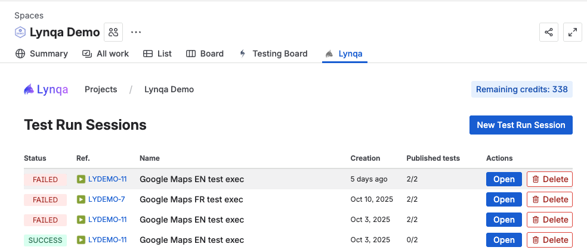

# Contrôler l'exécution

Cette section explique comment contrôler et gérer les exécutions de test en cours et passées dans Lynqa.

## Aperçu

Lynqa vous permet de surveiller et gérer les exécutions de test en temps réel. Vous pouvez explorer différents niveaux pour voir les informations détaillées d'exécution, des sessions d'exécution de test aux exécutions individuelles et leurs captures d'écran.

## Naviguer dans les exécutions de test

Lynqa fournit une vue hiérarchique des exécutions de test qui vous permet d'explorer plusieurs niveaux :

1. **Sessions d'exécution de test** - Voir toutes vos sessions d'exécution de test
2. **Session d'exécution de test** - Voir tous les tests individuels dans une session spécifique
3. **Exécution de test** - Examiner les étapes détaillées et les captures d'écran pour un test particulier

À chaque niveau, vous pouvez voir l'état d'exécution actuel pour un aperçu rapide du statut.

## Sessions d'exécution de test

La vue **Sessions d'exécution de test** fournit un aperçu de toutes vos sessions d'exécution de test. Ici vous pouvez voir :

- **État** - État d'exécution actuel de chaque session (SUCCESS, FAILED, etc.) (voir [États d'exécution](#états-dexécution) pour les détails)
- **Référence** - Identifiant unique pour la carte d'exécution de test
- **Nom** - Nom descriptif de l'exécution de test
- **Création** - Date de création de la session
- **Tests publiés** - Nombre de tests terminés sur le total
- **Actions** - Bouton Ouvrir pour explorer les détails de la session, ou bouton Supprimer pour supprimer la session

Cliquez sur le bouton **Ouvrir** sur n'importe quelle session pour explorer et voir les tests individuels dans cette session.

## Détail de la session d'exécution de test

Lorsque vous ouvrez une session d'exécution de test spécifique, vous verrez tous les tests individuels qui faisaient partie de cette session d'exécution.

Pour chaque test de la session, vous pouvez voir :
- **État** - L'état d'exécution du test (SUCCESS, FAILED, etc.) (voir [États d'exécution](#états-dexécution) pour les détails)
- **Référence** - L'identifiant de référence du cas de test
- **Nom** - Le nom descriptif du test
- **Résultats enregistrés** - Date du dernier enregistrement des résultats vers XRay
- **Actions** - Ouvrir le test, enregistrer les résultats vers XRay, ou voir les résultats dans XRay

Le statut global de la session est affiché en haut, montrant si la session entière est SUCCESS ou FAILED en fonction des résultats des tests individuels.

## Détail de l'exécution de test

Explorer plus en détail une exécution de test spécifique vous montre les informations d'exécution détaillées.

Ici vous pouvez voir :
- **État global** - SUCCESS, FAILED, RUNNING, etc. (voir [États d'exécution](#états-dexécution) pour les détails)
- **Nom et référence du test** - Identifie le test spécifique
- **Étapes d'exécution** - Chaque action effectuée pendant le test (CLIC, TAPER, APPUYER, etc.)
- **Captures d'écran** - Preuve visuelle capturée à chaque étape avec des icônes d'appareil photo
- **Résultats attendus** - Ce que le test s'attendait à vérifier
- **Résultats réels** - Ce qui a été réellement trouvé, indiqué par des coches vertes

Cliquer sur n'importe quelle icône de capture d'écran ou le bouton "Capture d'écran" ouvre une vue détaillée de cette capture d'écran spécifique.

## Voir les captures d'écran

Lorsque vous visualisez une capture d'écran, une fenêtre modale affiche l'état capturé à ce point précis de l'exécution du test.

Cela vous permet de :
- Vérifier les états visuels à tout moment pendant l'exécution du test
- Déboguer les tests échoués en voyant exactement à quoi ressemblait l'application
- Valider que les éléments attendus étaient présents sur la page

Utilisez le bouton "Fermer" pour revenir à la vue détaillée de l'exécution de test.

## États d'exécution

Dans tous les niveaux de navigation, vous verrez des états d'exécution qui indiquent le statut actuel de vos tests et sessions :

### SUCCESS
Un badge vert SUCCESS indique que le test ou la session s'est terminé avec succès sans aucun échec.

### FAILED
Un badge rouge FAILED indique que le test ou la session a rencontré des étapes échouées pendant l'exécution.

### ERROR
Un état ERROR indique que l'exécution a rencontré une erreur qui l'a empêchée de se terminer.

### RUNNING
Un état RUNNING signifie que le test ou la session est actuellement en cours d'exécution.

### STOPPED
Un état STOPPED indique que l'exécution a été manuellement arrêtée avant d'être complétée.

## Prochaines étapes

- [Sauvegarder les résultats de test vers XRay](xray-integration.md) - Apprenez à sauvegarder les résultats vers XRay
- [Premiers pas](getting-started.md) - Retourner au guide de démarrage
