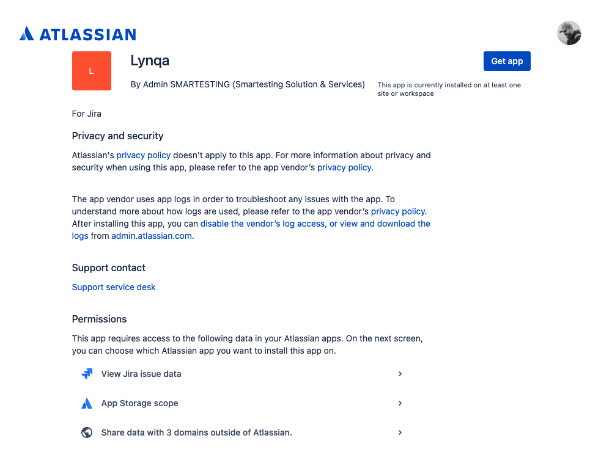
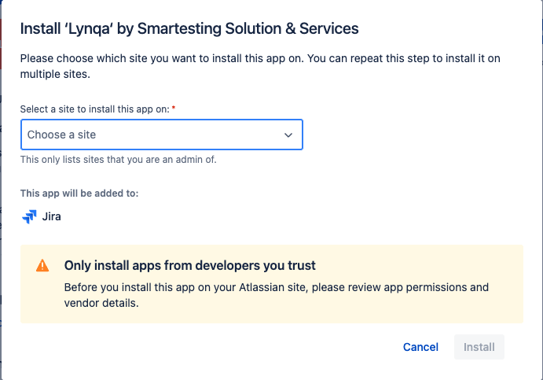
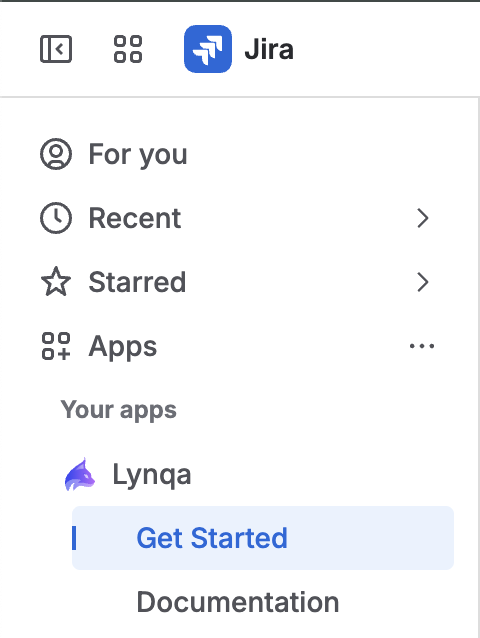
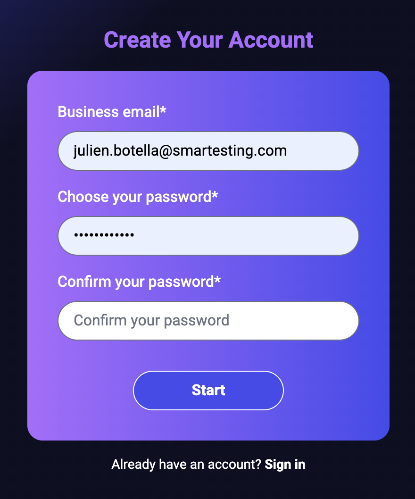
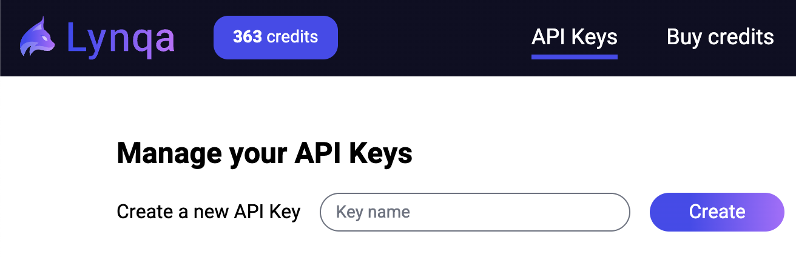
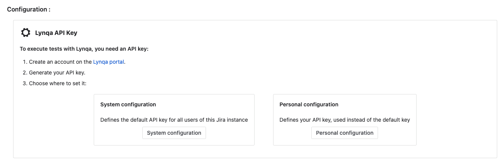
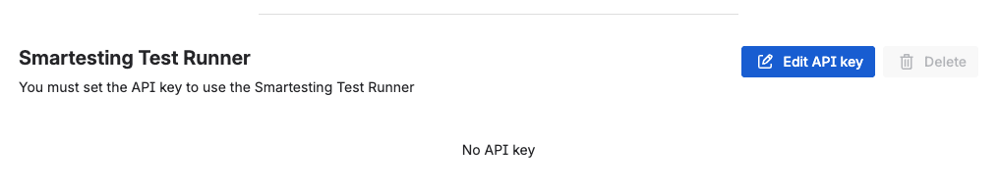
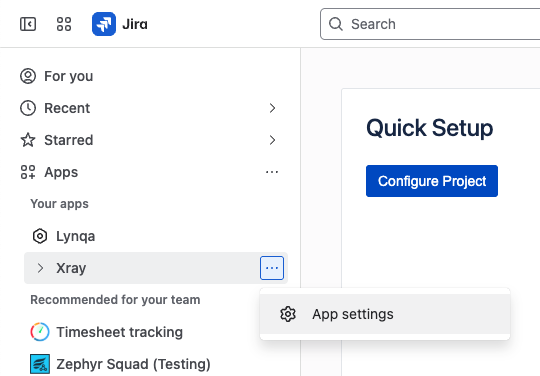
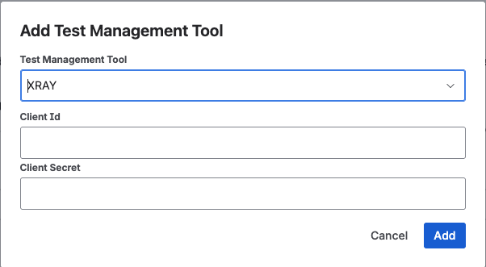

# Premiers pas

> Bienvenue dans Lynqa ! Ce guide vous aidera à démarrer rapidement.

## Prérequis

### Instance JIRA Cloud avec l'application XRay installée

1. **Assurez-vous d'avoir accès à une instance JIRA Cloud avec le rôle d'administrateur**
2. **Assurez-vous que l'application Xray est installée sur votre instance JIRA**

## Installation

### Étape 1 : Installer l'application Lynqa sur votre instance JIRA Cloud

1. Cliquez sur ce [lien](https://marketplace.atlassian.com/apps/31307c66-e3ef-49b2-9670-e7117fe00517), ou recherchez Lynqa sur le marketplace, et cliquez sur "Obtenir l'application" après avoir vérifié les permissions.

2. Choisissez sur quelle instance JIRA Cloud vous souhaitez installer et cliquez sur "Installer".

### Étape 2 : Configurer la clé API Lynqa

1. **Sous le menu "Vos applications", ouvrez "Commencer" dans le dossier Lynqa**

   

Avant de pouvoir commencer à utiliser Lynqa, vous devrez créer un compte et générer une clé API Lynqa.

2. **Visitez et inscrivez-vous sur la plateforme Lynqa**

   - Si vous n'avez pas de compte Lynqa, allez sur la page d'inscription Lynqa à https://my.lynqa.smartesting.com/register ou suivez le lien "Portail Lynqa" sur la page des paramètres Lynqa.

   

   - Vous recevrez un email de confirmation - cliquez sur le lien dans l'email pour vérifier votre compte. Vous devriez maintenant pouvoir vous connecter.

   

3. **Générer une clé API Lynqa**

   - Dans l'onglet API, générez une clé API en entrant un "Nom de clé" et en cliquant sur "Créer".

   

   - Copiez la clé car elle sera utilisée plus tard dans JIRA pour configurer Lynqa. Veuillez noter que vous ne pourrez pas récupérer cette clé par la suite.

4. **Configurer la clé API Lynqa**

   - Choisissez entre fournir la clé API Lynqa au niveau système, projet ou au niveau personnel.

   

   - Cliquez sur "Modifier la clé API" et collez la clé que vous avez copiée à l'étape précédente.

   

   - Retour à la page **Commencer**, vous devriez maintenant voir que la clé a été ajoutée avec succès.

### Étape 3 : Configurer XRay

1. **Obtenir les identifiants XRay**

   - Ouvrez les paramètres de l'application Xray

   

   - Naviguez vers **Clés API**

   - Générez une nouvelle clé API pour l'intégration Lynqa
   
   - Copiez la clé API et l'ID client

2. **Configurer dans Lynqa**

   - Retour à la page **Commencer** de Lynqa, choisissez entre fournir la clé API XRay au niveau Système, ou au niveau personnel pour Lynqa.

   

   - Cliquez sur "Ajouter" et collez la clé API et l'ID client que vous avez copiés à l'étape précédente.

   

   - Retour à la page **Commencer**, vous devriez maintenant voir que la clé a été ajoutée avec succès.

## Prochaines étapes

- [Lancer une exécution](launch-execution.md) - Apprenez à démarrer des exécutions de test
- [Contrôler l'exécution](control-execution.md) - Gérez les tests en cours
- [Sauvegarder les résultats vers XRay](xray-integration.md) - Configurez l'intégration XRay

## Support

Si vous rencontrez des problèmes lors de la configuration, veuillez contacter notre équipe de support à l'adresse suivante : [lynqa-support@smartesting.com](lynqa-support@smartesting.com).
