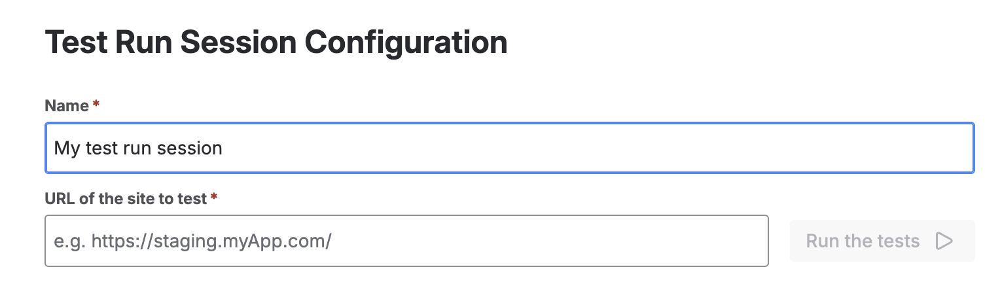
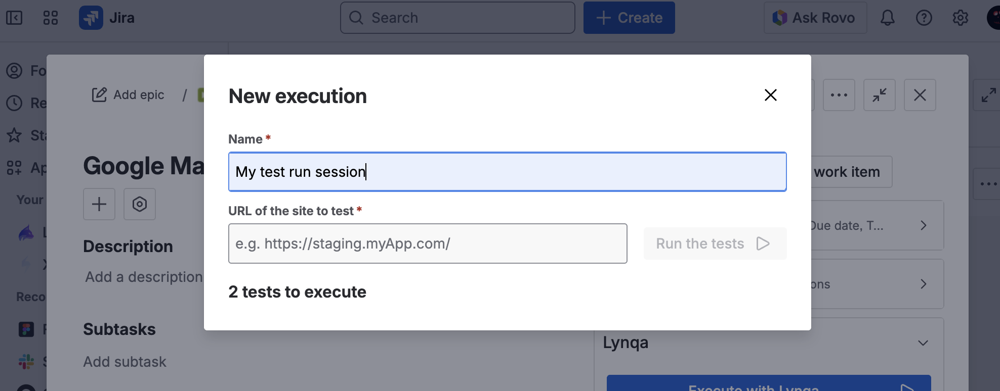

# Lancer une exécution

Cette section explique comment lancer des exécutions de test dans Lynqa.

## Aperçu

Lancer une exécution avec Lynqa vous permet d'exécuter vos cas de test et de surveiller leur progrès en temps réel.

## Lancer une exécution de test

### Depuis le panneau Lynqa

Le panneau Lynqa fournit un moyen de lancer des exécutions de test directement depuis votre navigateur. Suivez ces étapes :

1. **Ouvrir le panneau Lynqa**
   
   
   
   Cliquez sur l'onglet Lynqa pour ouvrir le panneau Lynqa. Cela affichera l'interface principale où vous pouvez gérer vos exécutions de test. Puis appuyez sur le bouton "New Test Run Session".

2. **Sélectionner une exécution de test**
   
   
   
   Dans la liste des exécutions de test du panneau Lynqa, choisissez l'exécution de test que vous souhaitez exécuter. Cela permettra de lancer les cas de test associés à cette exécution.

3. **Saisir l'URL cible**
   
   
   
   Dans le champ URL, saisissez l'URL du site web ou de l'application cible sur lequel vous souhaitez exécuter vos tests.

4. **Lancer l'exécution**
   
   
   
   Cliquez sur le bouton "Run" pour démarrer l'exécution de test. Le panneau affichera le statut et la progression de l'exécution en temps réel, vous permettant de surveiller l'exécution des tests au fur et à mesure.

### Depuis une exécution de test dans Jira

Vous pouvez également lancer des exécutions de test directement depuis Jira en utilisant l'intégration Lynqa. Cette méthode vous permet d'exécuter des tests directement depuis vos éléments de travail d'exécution de test.

1. **Ouvrir la carte d'exécution de test**
   
   
   
   Naviguez vers votre élément de travail d'exécution de test dans Jira et ouvrez la carte. Dans la barre latérale droite, vous trouverez la section Lynqa avec un bouton "Execute with Lynqa". Cliquez sur ce bouton pour démarrer le processus d'exécution.

2. **Saisir l'URL cible**
   
   
   
   Une modale "New execution" apparaîtra. Saisissez un nom pour votre session d'exécution de test (par défaut : "My test run session") et spécifiez l'URL du site que vous souhaitez tester dans le champ "URL of the site to test". Le système vous montrera combien de tests sont prêts à être exécutés.

3. **Lancer l'exécution**
   
   
   
   Une fois que vous avez saisi les informations requises, cliquez sur le bouton "Run the tests" pour démarrer l'exécution. Les tests commenceront à s'exécuter et vous pourrez surveiller leur progression via l'interface Lynqa.

## Dépannage

### Problèmes courants

**Problèmes d'accès à l'URL**
- Assurez-vous que l'URL fournie est publiquement accessible, car les serveurs Lynqa doivent pouvoir y accéder
- Si l'URL est derrière un pare-feu ou un VPN, elle ne sera pas accessible à Lynqa

**Problèmes de jetons**
- Si vous manquez de jetons d'exécution, vous devrez en acheter
- Visitez le tableau de bord Lynqa à https://my.lynqa.smartesting.com pour vérifier votre solde de jetons et acheter des jetons supplémentaires si nécessaire

## Prochaines étapes

- [Contrôler l'exécution](control-execution.md) - Apprenez à gérer les exécutions en cours
- [Sauvegarder les résultats vers XRay](xray-integration.md) - Configurez la sauvegarde des résultats vers XRay
