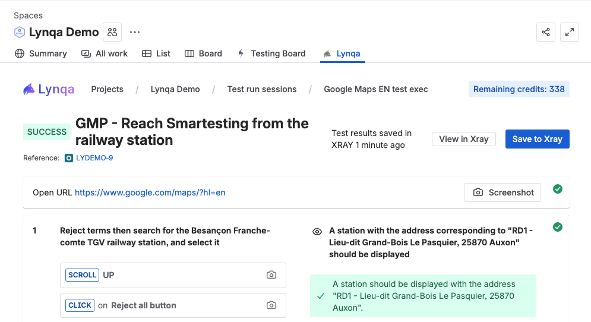

# Sauvegarder les résultats vers XRay

Cette section explique comment sauvegarder les résultats de test des exécutions Lynqa vers Xray.

## Aperçu

L'intégration XRay vous permet de sauvegarder automatiquement les résultats d'exécution de test de Lynqa vers votre projet XRay, permettant une meilleure gestion des tests, des rapports et une traçabilité.

## Sauvegarder les résultats vers XRay

Vous pouvez sauvegarder les résultats de test vers XRay à deux niveaux différents dans l'interface Lynqa :

1. **Depuis une session d'exécution de test** - Sauvegardez tous les résultats de test d'une session entière en une fois
2. **Depuis une exécution de test individuelle** - Sauvegardez les résultats pour un test spécifique

### Sauvegarder depuis une session d'exécution de test

Lors de la visualisation de la page de détail d'une session d'exécution de test :

Pour chaque test individuel de la session, vous pouvez voir :
- **Résultats enregistrés** - Indique quand les résultats ont été enregistrés pour la dernière fois vers XRay
- **Actions** - Inclut un bouton "Save to Xray" pour sauvegarder les résultats du test

Le bouton "Save to Xray" vous permet de publier les résultats de test de Lynqa vers votre projet XRay. Vous pouvez également cliquer sur "Ouvrir" pour explorer les détails de l'exécution de test.

### Sauvegarder depuis une exécution de test individuelle

Lors de la visualisation de la page de détail d'une exécution de test spécifique :

En haut à droite de l'exécution de test, vous trouverez :
- **Test results saved in XRAY** - Affiche quand les résultats ont été publiés pour la dernière fois
- **Save to Xray** (bouton) - Publie les résultats de l'exécution de test actuelle vers XRay
- **View in Xray** (bouton) - Ouvre les résultats de test publiés dans votre projet XRay

Cliquez sur "Save to Xray" pour publier les résultats de test. Une fois sauvegardé, l'horodatage sera mis à jour pour afficher le dernier moment de sauvegarde.

### Voir les résultats dans XRay

Après avoir sauvegardé les résultats vers XRay, vous pouvez les voir directement dans votre projet XRay :

Le bouton "View in Xray" apparaît à la fois sur :
- Les exécutions de test individuelles (dans la vue de détail de l'exécution de test)
- Les pages de session d'exécution de test (dans la vue de détail de la session)

Cliquez sur ce bouton pour ouvrir les résultats de test publiés dans XRay. Dans XRay, vous pouvez voir :
- **Statuts des étapes** - Chaque étape de test et son statut d'exécution (PASSED, FAILED, etc.)
- **Détails du test** - Les informations complètes du test et les références
- **Preuves** - Les captures d'écran et artefacts de l'exécution du test
- **Traçabilité** - Les liens vers les exigences et autres artefacts de test

## Prochaines étapes

- [Premiers pas](getting-started.md) - Retourner au guide de démarrage
- [Lancer une exécution](launch-execution.md) - Apprenez à lancer des exécutions
- [Contrôler l'exécution](control-execution.md) - Apprenez à contrôler les exécutions
