# Getting Started

> Welcome to Lynqa! This guide will help you get up and running quickly.

## Prerequisites

### JIRA Cloud instance with XRay app installed

1. **Ensure you have access to a JIRA Cloud instance with administration role**
2. **Ensure Xray app is installed on you JIRA instance**

## Installation

### Step 1: Install Lynqa app on your JIRA Cloud instance

1. Click the link sent by our support team, and click "Get app" after checking permissions.

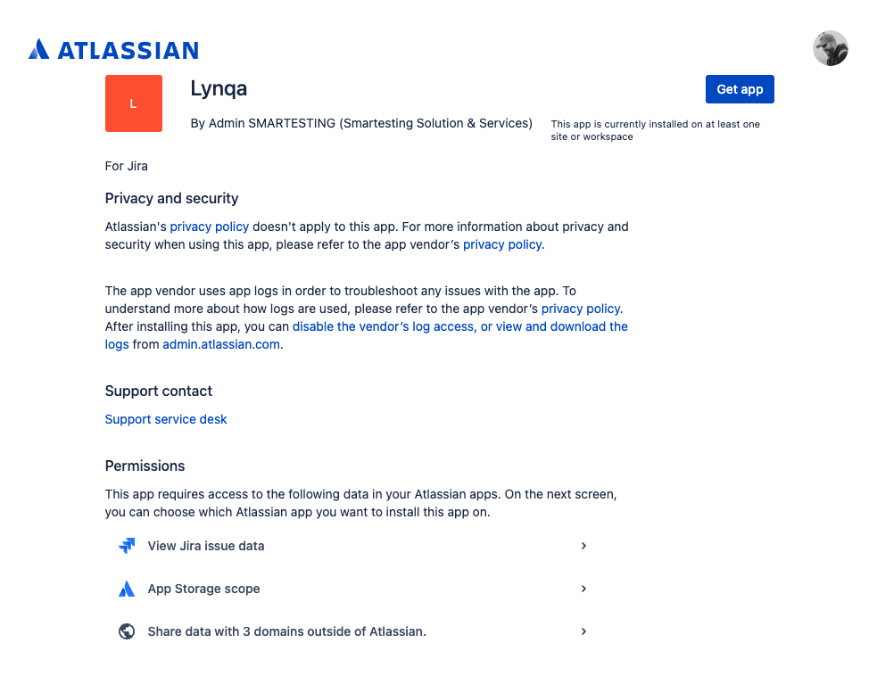

2. Choose on which JIRA Cloud instance you want to install and click "Install".

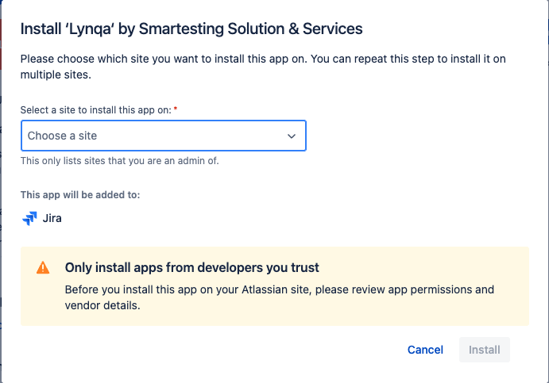

### Step 2: Configure Lynqa API key

1. **Under the "Your apps" menu, open "Get Started" in Lynqa folder**

   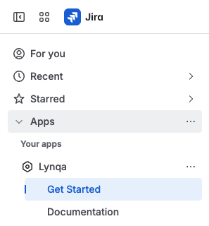

Before you can start using Lynqa, you'll need to create an account and generate and a Lynqa API key.

2. **Visit and register to the Lynqa Platform**

   - If you don't have a Lynqa account, go to the Lynqa registration page at https://api.testrunner.smartesting.com/app/register or follow the "Lynqa portal" link on the Lynqa Settings page.

   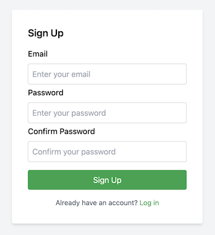

   - You will receive a confirmation email - click the link in the email to verify your account. You should now be able to signin.

   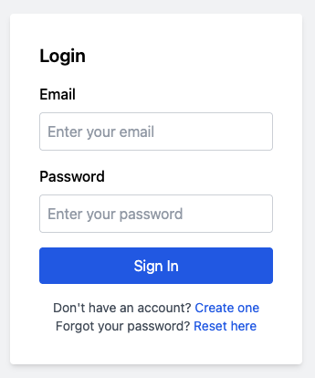

3. **Generate Lynqa API key**

   - On the API tab, generate an API key by entering a "Key name" and clicking on "Create".

   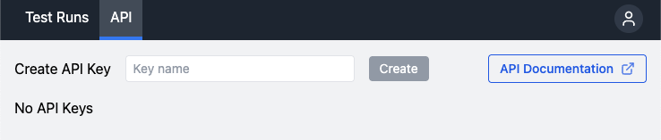

   - Copy the key as it will be used further in JIRA to configure Lynqa. Please note that you won't be able to retrieve that key afterwards.

4. **Configure Lynqa API key**

   - Choose between providing Lynqa API Key at a System level, or personal level.

   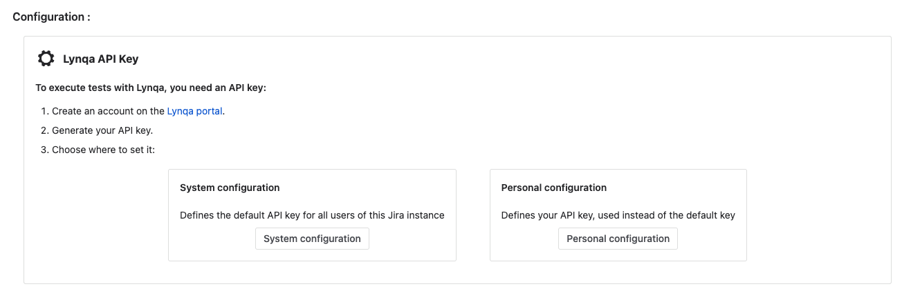

   - Click "Edit API key" and paste the key you have copied at previous step.

   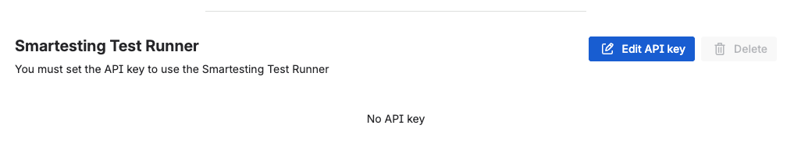

   - Back to the **Get Started** page, you should now see that the key is successfully added.

### Step 3: Configure XRay

1. **Get XRay Credentials**

   - Open Xray app settings

   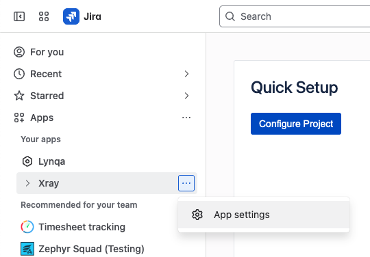

   - Navigate to **API Keys**

   - Generate a new API key for Lynqa integration
   
   - Copy the API key and client ID

2. **Configure in Lynqa**

   - Back to Lynqa **Get Started** page, choose between providing XRay API Key at a System level, or personal level for Lynqa.

   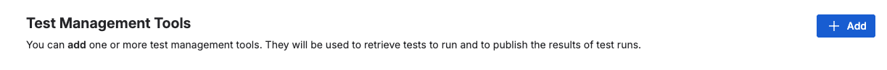

   - Click "Add" and paste the the API key and client ID you have copied at previous step.

   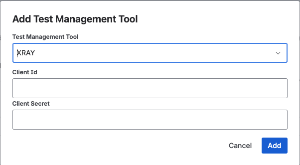

   - Back to the **Get Started** page, you should now see that the key is successfully added.

## Next Steps

- [Launch Execution](launch-execution.md) - Learn how to start test executions
- [Control Execution](control-execution.md) - Manage running tests
- [Save test results to XRay](xray-integration.md) - Configure XRay integration

## Support

If you encounter any issues during setup, please contact our support team or check the troubleshooting section.
