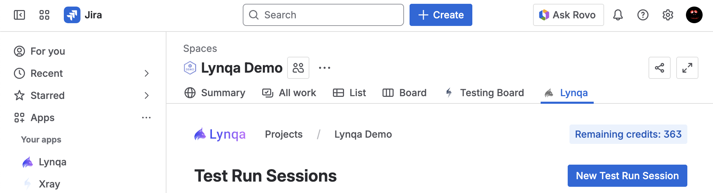
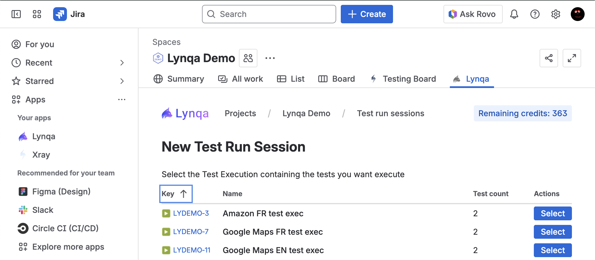
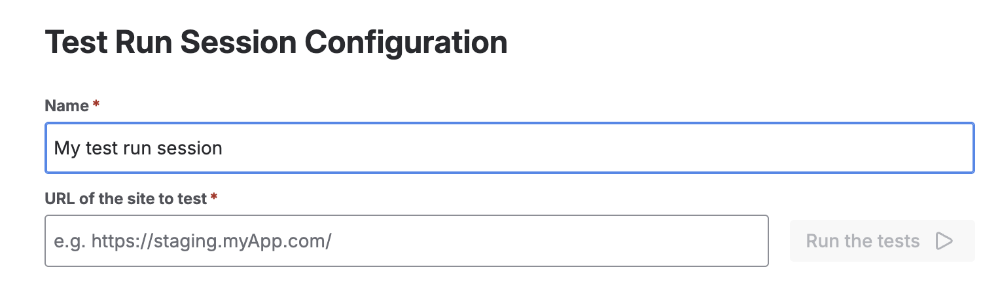
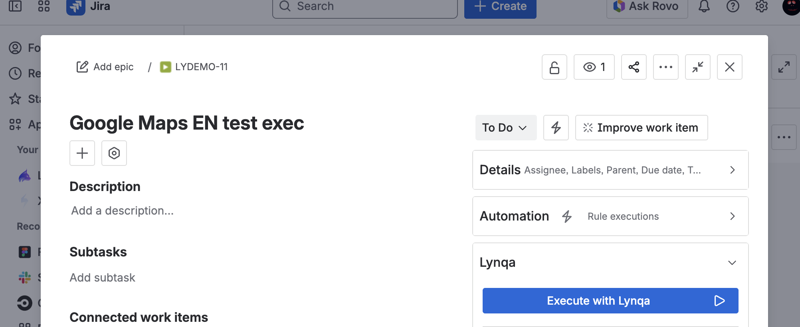
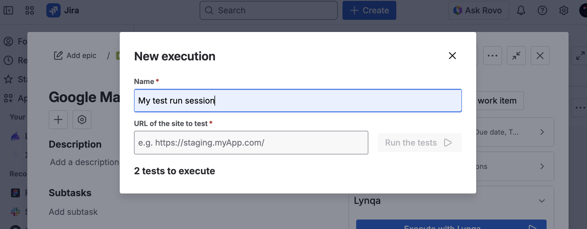

# Launch Execution

This section explains how to launch test executions in Lynqa.

## Overview

Launching an execution with Lynqa allows you to run your test cases and monitor their progress in real-time.

## Launching a Test Execution

### From the Lynqa panel

The Lynqa panel provides a convenient way to launch test executions directly from your browser. Follow these steps:

1. **Open the Lynqa panel**
   
   
   
   Click on the Lynqa tab to open the Lynqa panel. This will display the main interface where you can manage your test executions. Then press the "New Test Run Session" button.

2. **Select a Test Execution**
   
   
   
   From the test execution list in the Lynqa panel, choose the test execution you want to run. This will enable to launch the test cases associated with that execution.

3. **Enter the Target URL**
   
   
   
   In the URL field, enter the target website or application URL on which you want to execute your tests.

4. **Launch the Execution**
   
   
   
   Click the "Run" button to start the test execution. The panel will show the execution status and progress in real-time, allowing you to monitor the test run as it happens.

### From a Test Execution in Jira

You can also launch test executions directly from within Jira using the Lynqa integration. This method allows you to run tests directly from your test execution work items.

1. **Open the Test Execution Card**
   
   
   
   Navigate to your test execution work item in Jira and open the card. In the right sidebar, you'll find the Lynqa section with an "Execute with Lynqa" button. Click this button to start the execution process.

2. **Enter the Target URL**
   
   
   
   A "New execution" modal will appear. Enter a name for your test run session (default: "My test run session") and specify the URL of the site you want to test in the "URL of the site to test" field. The system will show you how many tests are ready to execute.

3. **Launch the Execution**
   
   
   
   Once you've entered the required information, click the "Run the tests" button to start the execution. The tests will begin running and you can monitor their progress through the Lynqa interface.

## Troubleshooting

### Common Issues

**URL Access Issues**
- Make sure the provided URL is publicly accessible, as Lynqa servers need to be able to reach it
- If the URL is behind a firewall or VPN, it will not be accessible to Lynqa

**Token Issues**
- If you run out of execution tokens, you'll need to purchase more
- Visit the Lynqa dashboard at https://my.lynqa.smartesting.com to check your token balance and buy additional tokens if needed

## Next Steps

- [Control Execution](control-execution.md) - Learn how to manage running executions
- [Save test results to XRay](xray-integration.md) - Configure result saving to XRay
