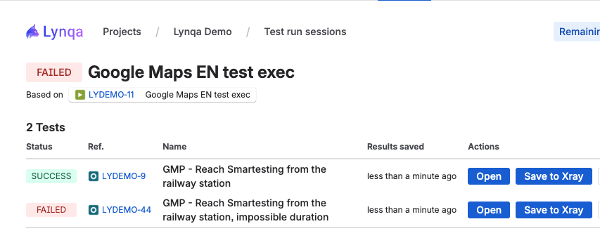

# Save test results to XRay

This section explains how to save test results from Lynqa executions to Xray.

## Overview

XRay integration allows you to automatically save test execution results from Lynqa to your XRay project, enabling better test management, reporting, and traceability.

## Saving Results to XRay

You can save test results to XRay from two different levels in the Lynqa interface:

1. **From a Test Run Session** - Save all test results from an entire session at once
2. **From an Individual Test Run** - Save results for a specific test run

### Save from Test Run Session

When viewing a test run session detail page:

For each individual test in the session, you can see:
- **Results saved** - Indicates when the results were last saved to XRay
- **Actions** - Includes a "Save to Xray" button to save the test results

The "Save to Xray" button allows you to publish the test results from Lynqa to your XRay project. You can also click "Open" to drill down into the test run details.

### Save from Individual Test Run

When viewing a specific test run detail page:

At the top right of the test run, you'll find:
- **Test results saved in XRAY** - Shows when the results were last published
- **Save to Xray** button - Publishes the current test run results to XRay
- **View in Xray** button - Opens the published test results in your XRay project

Click "Save to Xray" to publish the test results. Once saved, the timestamp will update to show the latest save time.

### View Results in XRay

After saving results to XRay, you can view them directly in your XRay project:

The "View in Xray" button appears both on:
- Individual test runs (in the test run detail view)
- Test run session pages (in the session detail view)

Click this button to open the published test results in XRay. In XRay, you can see:
- **Step statuses** - Each test step and its execution status (PASSED, FAILED, etc.)
- **Test details** - The complete test information and references
- **Evidence** - Screenshots and artifacts from the test execution
- **Traceability** - Links to requirements and other test artifacts

## Next Steps

- [Getting Started](getting-started.md) - Return to getting started guide
- [Launch Execution](launch-execution.md) - Learn how to launch executions
- [Control Execution](control-execution.md) - Learn how to control executions
